# FIAP - Faculdade de Informática e Administração Paulista

<p align="center">
<a href= "https://www.fiap.com.br/"></a>
</p>

<br>

# Fase Final 7

## Grupo DRELL

## 👨‍🎓 Integrantes: 
- <a href="https://www.linkedin.com/in/douglas-souza-felipe-b815281a2/">Douglas</a>
- <a href="https://www.linkedin.com/in/richard-marques-26b3a14/">Richard</a>
- <a href="https://www.linkedin.com/in/lucasmedeirosleite">Lucas Medeiros</a> 
- <a href="https://www.linkedin.com/in/mariana-cavalcante-oliveira-987684223/">Mariana Cavalcante Oliveira</a>
- <a href="https://www.linkedin.com/in/luis-fernando-dos-santos-costa-b69894365/">Luis</a>

## 👩‍🏫 Professores:
### Tutor(a) 
- <a href="https://github.com/leoruiz197">Leo Ruiz</a>
### Coordenador(a)
- <a href="https://www.linkedin.com/in/andregodoichiovato/">Andre Godoi</a>


## 📜 Descrição

Este é o repositório final onde consolidamos todas as entregas feitas durante o ano. 

Assista o video com a demonstração deste trabalho em tempo real, mas se preferir siga os passos da sessão "Como executar o código" e  roda essa solução no seu ambiente. 
<BR>
[](https://youtu.be/Ayi1PYAkx48)]

### Fase 1: Modelagem de base de dados e algorítimo 
Esta foi a base de dados que modelamos no inicio do ano para armazenar os dados de forma estruturada das coletas organizados por localização, tipo e sensor.


### Fase 2-4: implementação da base e integração com solução IoT que captura os dados e grava nesta base de dados
Nestas etapas, evoluimos para ter um sensor IoT monitorando os locais de produtivos com sensores específicos e alimentar a base de dados feita na etapa anterior de forma automática


Aqui abaixo tem o link da documentação desta etapa que descreve e detalhes como instanciar a base e popular ela com dados de sensores ESP32 simulados via Wokwi.
[Fase 2-4](fases_anterrioires/fase4/README.md)

Segue um video desta etapa funcionando de forma isolada:
[Assista ao vídeo](assets/logo-youtube.png)

Porém para rodar este projeto / repositório, você não precisa fazer estas etapas, mais abaixo na documentação existe um passo a passo para pareparar seu ambiente para executar tudo o que precisa para ele funcionar.


### Fase 5: Uso da computação em núvem para executar os projetos na AWS
Nesta etapa vamos integrar o comportamento das analises feitas na lavoura com um sistema de notificação na AWS com uso dos componentes SNS, Lambda e API Gateway. 


### Fase 6: Reconhecimento de objetos em Imagem usando YOLO
Segue a documentação do passo a passo realizado via Jupyter Notebook para preparar os dados e treinar um modelo de IA que reconhece 2 tipos de pragas em fotos da lavoura: Percevejo marron e Lagarta.
[Fase 6](fases_anterioires/fase6/README.md)
Da mesma forma que a fase de 2-4 não é necessário reproduzir estes passos para testar o projeto. Temos uma imagem em container com a solução treinada que mais abaixo nesta documentação terá o comando necessário para subir esta parte da soluçaõ já configurada e treinada. 

## 📁 Estrutura de pastas

Dentre os arquivos e pastas presentes na raiz do projeto, definem-se:

- <b>.github</b>: Nesta pasta ficarão os arquivos de configuração específicos do GitHub que ajudam a gerenciar e automatizar processos no repositório.

- <b>assets</b>: aqui estão os arquivos relacionados a elementos não-estruturados deste repositório, como imagens.

- <b>config</b>: Posicione aqui arquivos de configuração que são usados para definir parâmetros e ajustes do projeto.

- <b>db</b>: Arquivos de banco de dados em geral como `schema.sql` e `seeds.py`.

- <b>document</b>: aqui estão todos os documentos do projeto que as atividades poderão pedir. Na subpasta "other", adicione documentos complementares e menos importantes.

- <b>scripts</b>: Posicione aqui scripts auxiliares para tarefas específicas do seu projeto. Exemplo: deploy, migrações de banco de dados, backups.

- <b>src</b>: Todo o código fonte criado para o desenvolvimento do projeto ao longo das 7 fases.

- <b>README.md</b>: arquivo que serve como guia e explicação geral sobre o projeto (o mesmo que você está lendo agora).

## Pré requisitos para rodar localmente:
* Docker instalado
* MySQL 8 container rodando (atualize o arquivo `config/database.yml` e substitua a configuração `container` com o nome do seu container)

## 🔧 Como executar o código

*Acrescentar as informações necessárias sobre pré-requisitos (IDEs, serviços, bibliotecas etc.) e instalação básica do projeto, descrevendo eventuais versões utilizadas. Colocar um passo a passo de como o leitor pode baixar o seu código e executá-lo a partir de sua máquina ou seu repositório. Considere a explicação organizada em fase.*

### 1.0 Banco de dados

#### 1.1 Carregando o conatainer com o MySQL
Execute o comando abaixo para criar uma instancia de Banco de dados mySQL
```
docker run -d --name mysql -e MYSQL_ROOT_PASSWORD=root -e MYSQL_DATABASE=agro_dev -e MYSQL_USER=agro -e MYSQL_PASSWORD=agro1 -p 3306:3306 -v mysql_data:/var/lib/mysql docker.io/mysql:8.0
```
Este comando vai criar uma pasta mysql_data no diretório onde você estiver rodando o comando, pois caso precise parar e subir o ambiente os dados não se percam

### 1.2 - Crie a estrutura das tabelas 
Execute o comando abaixo para carregar o script SQL que cria a estrtura das tabelas e faZ a carga inicial de dados
```
cmd /c "docker exec -i mysql mysql -u root -proot agro_dev < db/schema.sql"
```
#### 1.3 Popula o banco com dados de exemplo
* Execute o comando abaixo para carregar os dados na base MySQL
```
python .\db\seeds.py
```

### 2.0 API de Reconhecimento de imagens

#### 2.1 Carregando o container com a API da aplicação 
* Execute o comando abaixo:
```
docker run -tid -p 5000:5000 --name=api-yolo seberino/faster-cnn:1.1 
```

### 3.0 Noticação / Alertas
Vamos configurar o sistema de notificação usando os recursos da AWS

#### 3.1 Criando um Topico SNS
* Navegue na sua console da AWS até o item SNS e clique no botão "Create Topic"
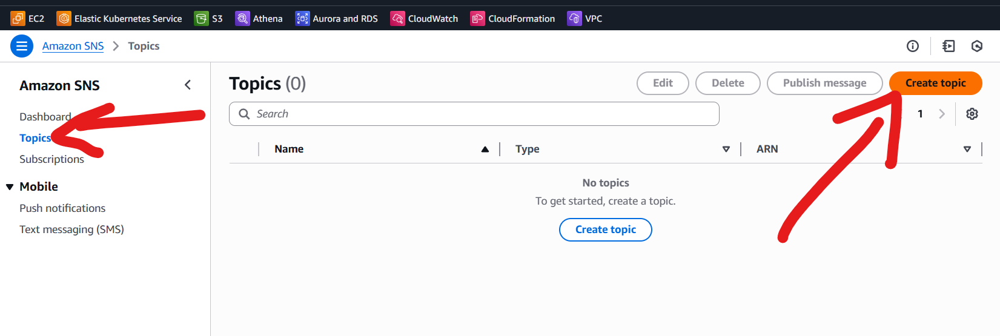

* Escolha a opção standard e coloque o nome "alerta-pragras" e clique no botão "Create Topic"
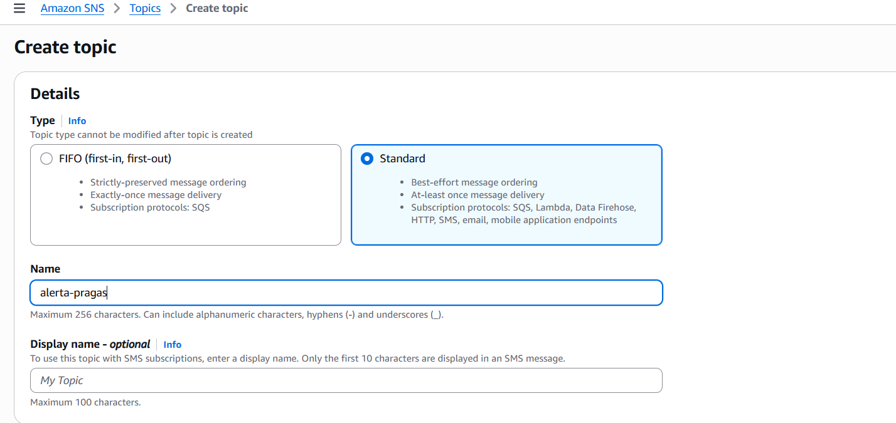

* Após a criação recupere (e guarde em algum lugar) o endereço ARN do topico que criamos.
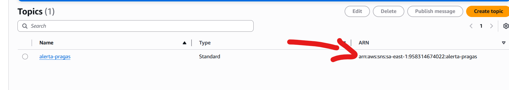

#### 3.2 Criando uma função Lambda
* Navegue até a página do recurso Lambda na sua console da AWS, e clique em "Create Function"
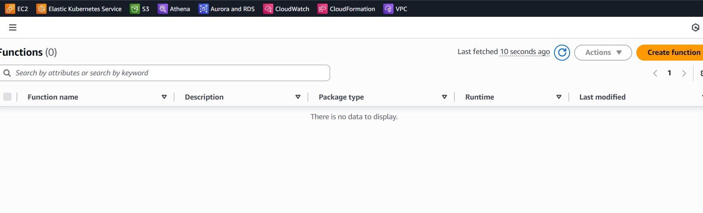

* Selecione a opção "Author from Scrach", defina o nome "processa-alerta", e clique em "Create Function"
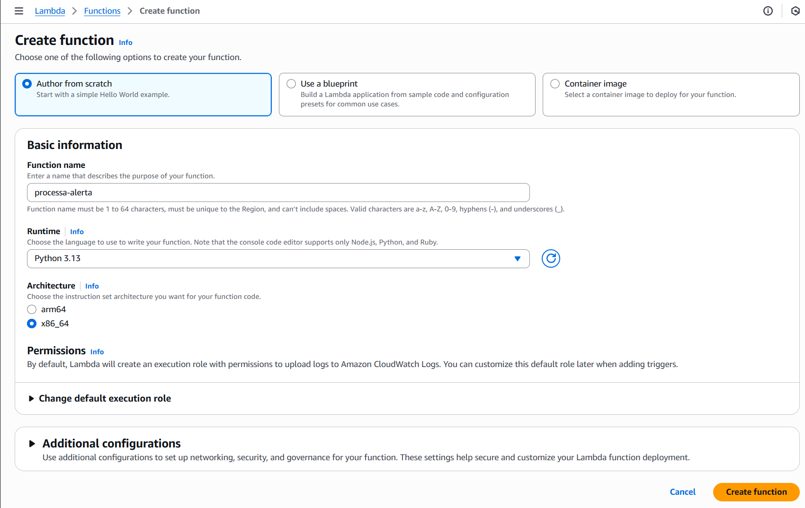

* No editor que abrir copie e cole o código a seguir, e depois clique em "Add environment variables":
```
import json
import boto3
import os
def lambda_handler(event, context):
    sns_client = boto3.client("sns", region_name="sa-east-1")  
    SNS_TOPIC_ARN = os.getenv("SNS_TOPIC_ARN")
    
    try:
        if "body" not in event or not event["body"]:
            return {"statusCode": 400, "body": json.dumps({"error": "Nenhum arquivo enviado"})}
        
        alerta = json.loads(event["body"])
        mensagem = alerta.get("mensagem")
        
        if not mensagem:
            return {"statusCode": 400, "body": json.dumps({"error": "Campo 'mensagem' é obrigatório"})}
        
        # Publica a mensagem no SNS
        response = sns_client.publish(
            TopicArn=SNS_TOPIC_ARN,
            Message=json.dumps(mensagem),
            Subject="Novo Alerta"
        )
        
        return {
            "statusCode": 200,
            "body": json.dumps({
                "message": "Alerta recebido e enviado para processamento",
                "alerta": mensagem
            })
        }
    except Exception as e:
        return {"statusCode": 500, "body": json.dumps({"error": str(e)})}
```

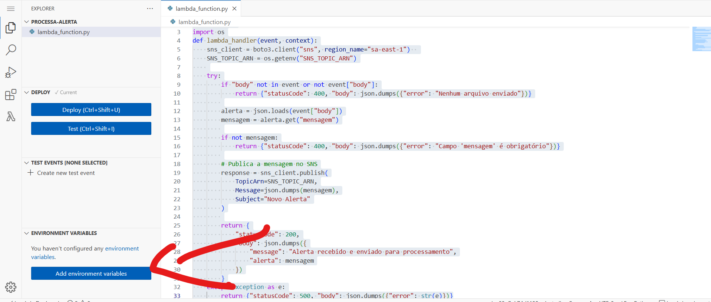

* No painel de variáveis de ambiente clique adicionar, informe o nome "SNS_TOPIC_ARN" e cole o valor que você copiou na estapa 3 da criação do Tópico SNS:
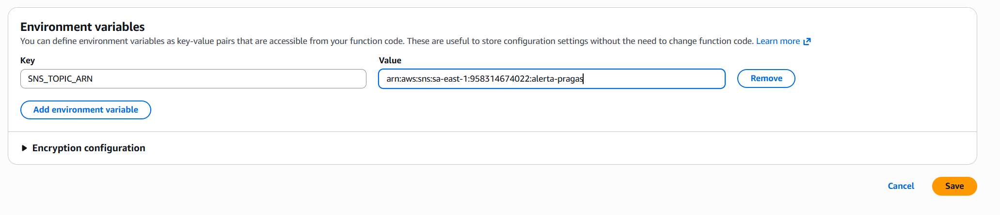

* Agora clique no botão "deploy"
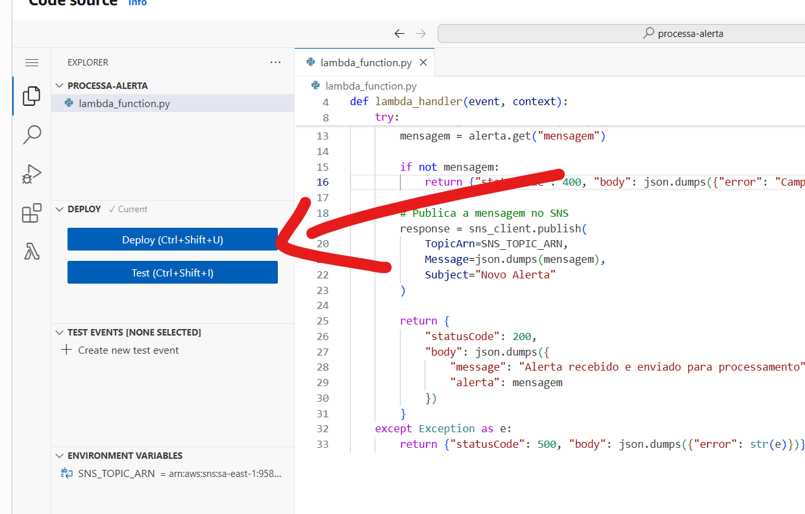

#### 3.3 Expor a Função Lambda no API Gateway
* Navegue até a página do recurso API Gateway da AWS e clique em "Create API"
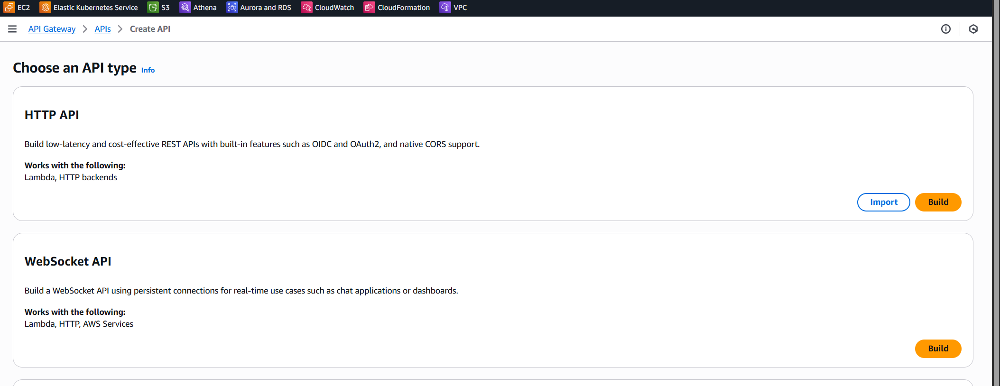

* Clique no botão "build" na opção "HTTP API"
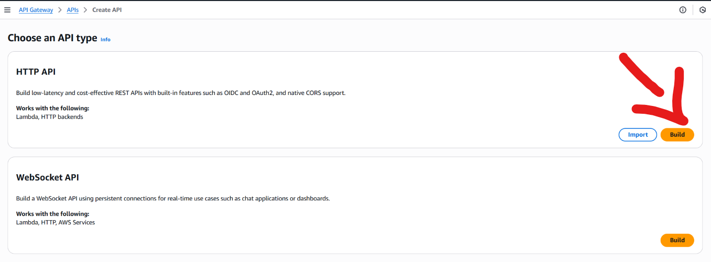

* Informe o nome "api-alerta-pragas" e clique em "Next" em todas as telas e na última em "Create"
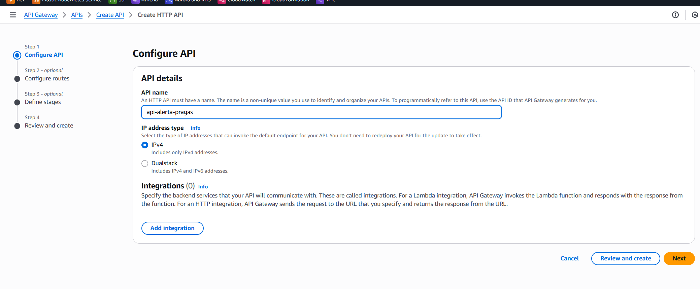

* Na tela principal da API que criamos, selecione a sub opção "Routes", e clique "Create" 
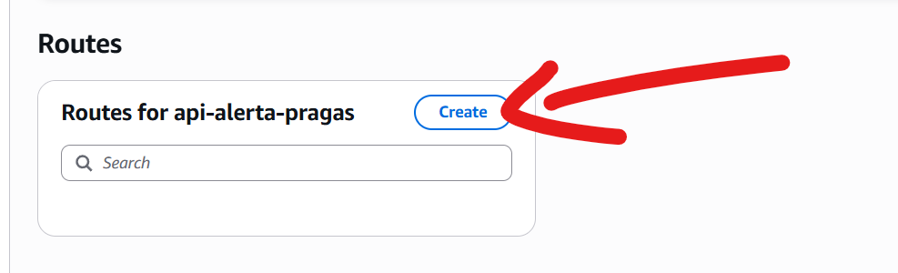

* Informe o nome "alerta", marque a opção de método como "Post" e clique em "Create"
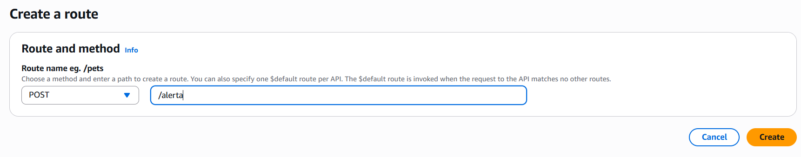

* Voltando a tela de edição da nossa API, com a rota "/alertas" na opção filho "POST" selecionado clique no botão "Attach integration"
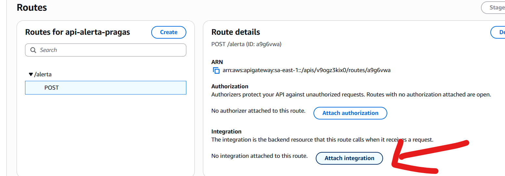

* Clique no botão "Create and Attach integration"
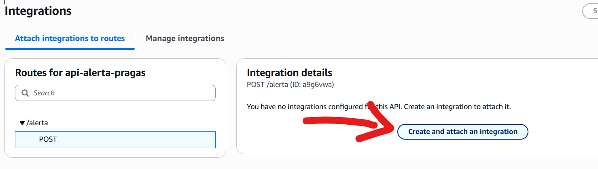

* Marque a opção do tipo de Integração como "Lamdba function", e selecione a função Lambda que criamos no passo 3.2 e clica em create
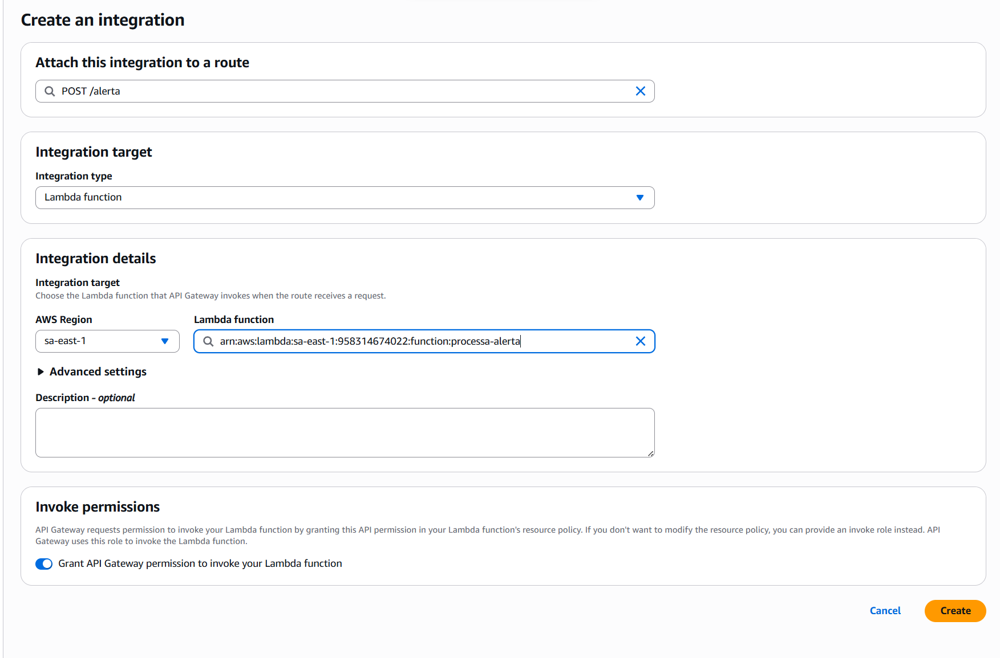

#### 3.4 Cria subscripção para envio de e-mail

* Devolta a tela das SNS na AWS, clique no tópico que criamos, depois selecione a aba "Subscription" 
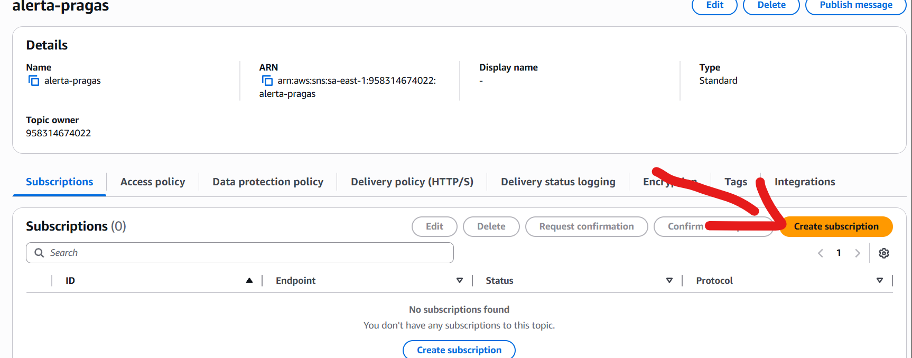

* Selecione o protocolo com a opção "e-mail", no campo endpoint coloque o seu endereço de e-mail.
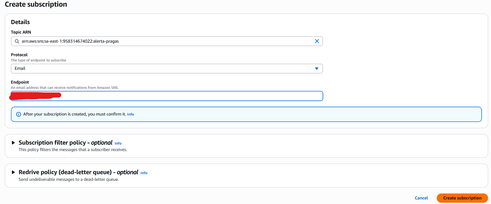

* A Etapa anterioir vai gerar um email que você deve receber na caixa de correio informada onde você precisa clicar em um link para confirmar aceitar notificações deste serviço


### 4.0 Interface Principal
Para carregar a interface princpal da aplicação, baseada em Streamlit, precisamos do Python 3.9 ou superior

#### 4.1 Crie um ambiente novo
* Execute o comando abaixo para criar um ambiente novo e ativar ele
```
python -m venv .venv
.\.venv\Scriptsactivate 
```

#### 4.2 Instale as dependencias
* Execute o comando abaixo para instalar as dependencias do projeto
```
python -m pip install -r requirements.txt
``` 

#### 4.3 Execute a aplicação
* Execute o comando abaixo para executar a aplicação principal, este comando já deve abrir seu navegador com a página padrão da aplicação
```
python -m streamlit run .\src\ui\app.py
```

## 🗃 Histórico de lançamentos

* 0.1.0 - 08/11/2025
    * Versão inicial

## 📋 Licença

<p xmlns:cc="http://creativecommons.org/ns#" xmlns:dct="http://purl.org/dc/terms/"><a property="dct:title" rel="cc:attributionURL" href="https://github.com/agodoi/template">MODELO GIT FIAP</a> por <a rel="cc:attributionURL dct:creator" property="cc:attributionName" href="https://fiap.com.br">Fiap</a> está licenciado sobre <a href="http://creativecommons.org/licenses/by/4.0/?ref=chooser-v1" target="_blank" rel="license noopener noreferrer" style="display:inline-block;">Attribution 4.0 International</a>.</p>


