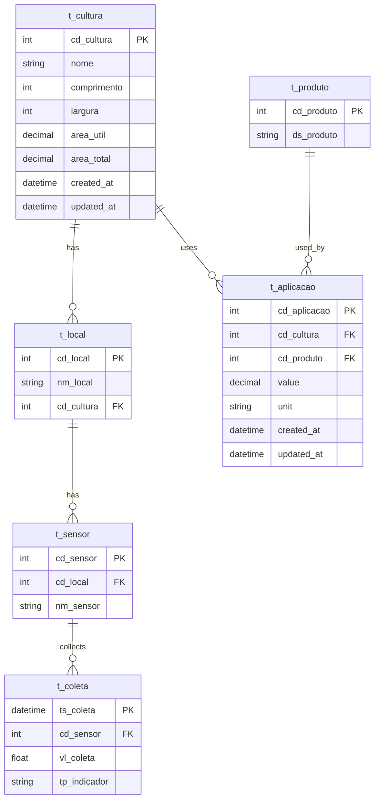

# Database Schema

## ERD

```mermaid
erDiagram
    t_cultura ||--o{ t_local : has
    t_cultura ||--o{ t_aplicacao : uses
    t_produto ||--o{ t_aplicacao : used_by
    t_local   ||--o{ t_sensor : has
    t_sensor  ||--o{ t_coleta : collects

    t_cultura {
        int cd_cultura PK
        string nome
        int comprimento
        int largura
        decimal area_util
        decimal area_total
        datetime created_at
        datetime updated_at
    }

    t_local {
        int cd_local PK
        string nm_local
        int cd_cultura FK
    }

    t_sensor {
        int cd_sensor PK
        int cd_local FK
        string nm_sensor
    }

    t_coleta {
        datetime ts_coleta PK
        int cd_sensor FK
        float vl_coleta
        string tp_indicador
    }

    t_produto {
        int cd_produto PK
        string ds_produto
    }

    t_aplicacao {
        int cd_aplicacao PK
        int cd_cultura FK
        int cd_produto FK
        decimal value
        string unit
        datetime created_at
        datetime updated_at
    }
```
