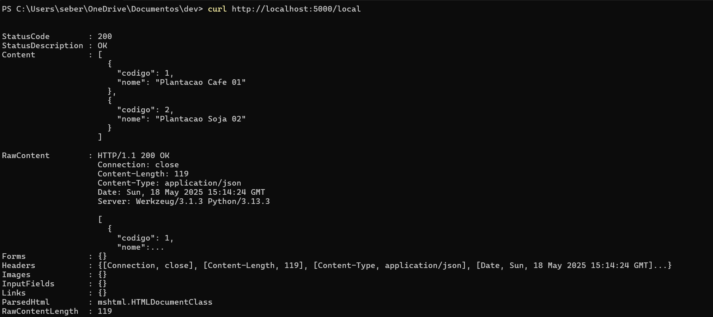
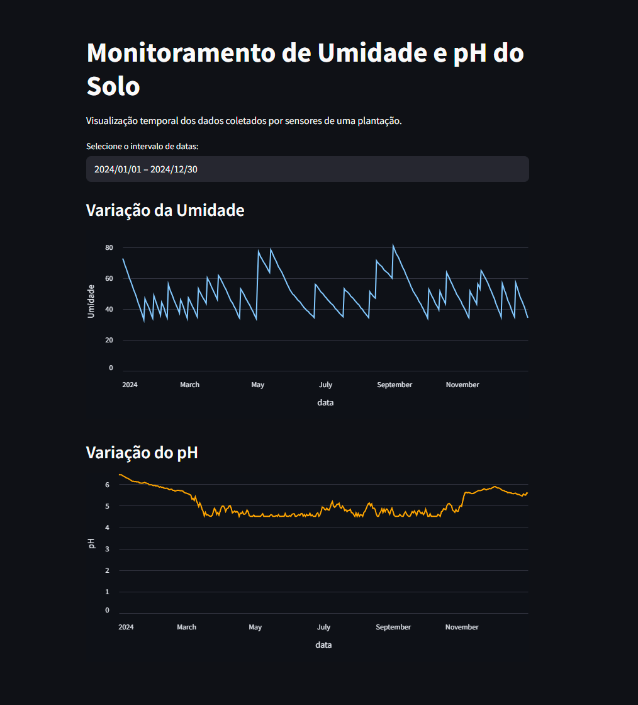

# APIs para gestão de dados coletados

## 1 - Introdução
Este repositório mantem os scripts para iniciar uma base mysql em docker e fazer a criação da estrutura do banco de dados necessária para a API de gestão de dados de coleta funcionar. 

A base de dados que vamos usar é <a href="https://github.com/richardseberino/fiap_fase2_cap10">Basde de Dados de Coleta</a>

## 2 - Preparação do ambiente

### 2.1 - Pre-requisitos
Para rodar esta API você precisa ter os seguintes requisitos atendidos:
* Docker instalado e funcionando 
* Python 3.11 ou superior 
* Postman ou alguma outra ferramenta (como curl) para chamada de APIs

### 2.2 - Iniciando a base de dados

Execute o comando abaixo para criar uma instancia de Banco de dados mySQL
```
docker run -d --name mysql-fiap -e MYSQL_ROOT_PASSWORD=fiap123 -e MYSQL_DATABASE=agro -e MYSQL_USER=agro -e MYSQL_PASSWORD=agro1 -p 3306:3306 -v mysql_data:/var/lib/mysql mysql:8.0
```
Este comando vai criar uma pasta mysql_data no diretório onde você estiver rodando o comando, pois caso precise parar e subir o ambiente os dados não se percam

### 2.3.1 - Crie a estrutura das tabelas e carregue os dados iniciais
Execute o comando abaixo para carregar o script SQL que cria a estrtura das tabelas e faZ a carga inicial de dados
```
docker cp scripts-db/banco-dados.sql mysql-fiap:/tmp
docker cp carrega-base.sh mysql-fiap:/tmp
docker exec -i mysql-fiap bash  /tmp/carrega-base.sh
```

#### 2.3.2 - Populando tabela com dados ficticios para treinamento do modelo e visualização gráfica
Execute o arquivo `./scripts-db/populate.py` após ter criado e carregado os dados iniciais para popular o banco com informações ficticias para treinamento do modelo

### 2.4 - Instale as dependencias do python
Execute o comando abaixo para instalar as bibliotecas necessárias para a API funcionar
```
pip install -r requirements.txt
```

## 3 - Executando a aplicacao

## 3.1 - Inicia a aplicacao python
Certifique-se de que você cumpriu todas as etapas do item 2 deste documento. 
Execute o comando a seguir para iniciar a aplicação python que expões as APIs RestFUL para interagir com a base de dados de coleta
```
python main.py
```

Nota: a aplicação por padrão responde na porta 5000, tenha certeza que esta porta não esteja sendo utilizada por nenhum outro programa no seu computador

## 3.2 - Testando a a aplicação
Para testar a aplicação você pode usar linha de comando (utilitário curl) ou qualquer ferramenta que suporte chamada de API Rest. 
Esta incluido neste repositório uma coleção de todos os comandos expostos pela API no padrão do Postman Postman-template.postan_collection

Para realizar um teste simples e rápido para vertificar o funcionamento da api execute o comando a seguir:
```
curl http://localhost:5000/local
```
Caso esteja funcionando você verá na tela um resultado parecido com a imagem a seguir: 

## 3.3 - Expondo a API via internet para ser acessivel pelo ESP32
Caso você for usar esta API junto com o microprocessador ESP32 para envio de dados de sensores você vai precisar expor a API que esta em execução na sua estação para a internet. 

A maneira mais fácil de fazer isso é com o Cloidflare. Instale ele com o comando a seguir:
```
winget install --id Cloudflare.cloudflared
```

Execute o comando a seguir para export a API para acesso a internet:
```
cloudflared tunnel --url http://localhost:5000
```

O Resultado deste comando gera alguns textos de saida e junto com eles a URL da sua Api. Copie essa URL para você poder usar ela para configurar o seu ESP32.


# 4 - APIs Disponíveis

## 4.1 - Locais
As apis expostas na URI /local são responsáveis por permitir listar os locais existentes, incluir novos locais e excluir locais

### 4.1.1 - Listar Locais
* URL: http://localhost:5000/local
* Header: Content-Type: application/json
* Método: GET

### 4.1.2 - Incluir um novo Local
* URL:http://localhost:5000/local
* Header: Content-Type: application/json
* Método: POST
* Payload: 
```
{
    "nome":"Novo Local de Plantacao"
}
```

### 4.1.3 - Excluir um Local
* URL: http://localhost:5000/local/{id}
* eader: Content-Type: application/json
* Método: DELETE
* Parmetro na URL: substitua {id} pelo código do local que deseja excluir (exemplo http://localhost:5000/local/2)
* Observação: O local não pode ter nenhum sensor associado a ela e não pode ter recebido aplicação de nenhum produto


## 4.2 - Produtos

### 4.2.1 - Listar Produtos
* URL: http://localhost:5000/produto
* Header: Content-Type: application/json
* Método: GET

### 4.2.2 - Incluir um novo Produto
* URL:http://localhost:5000/produto
* Header: Content-Type: application/json
* Método: POST
* Payload: 
```
{
    "nome":"Novo Produto"
}
```

### 4.2.3 - Excluir um Produto
* URL: http://localhost:5000/produto/{id}
* Header: Content-Type: application/json
* Método: DELETE
* Parmetro na URL: substitua {id} pelo código do produto que deseja excluir (exemplo http://localhost:5000/produto/2)
* Observação: O produto precisa existir e não pode ter sido aplicado em nenhum local de plantação

## 4.3 - Sensores

### 4.3.1 - Listar Sensores
* URL: http://localhost:5000/sensor
* Header: Content-Type: application/json
* Método: GET

### 4.3.2 - Incluir um novo Sensor
* URL:http://localhost:5000/produto
* Header: Content-Type: application/json
* Método: POST
* Payload: 
```
{
    "codigo_local": 1
    "nome":"Novo Sensor"
}
```

### 4.3.3 - Excluir um Sensor
* URL: http://localhost:5000/sensor/{id}
* Header: Content-Type: application/json
* Método: DELETE
* Parmetro na URL: substitua {id} pelo código do sensor que deseja excluir (exemplo http://localhost:5000/sensor/2)
* Observação: O Sensor precisa existir e não pode ter sido realizado nenhuma coleta nele

## 4.4 - Coleta

### 4.4.1 - Listar Coletas em um Local específico
* URL: http://localhost:5000/coleta/{local}
* Header: Content-Type: application/json
* Método: GET
* Parametro na URL: substitui {local} pelo código do local que deseja listar as coletas realizadas (exemlpo http://localhost:5000/coleta/1)

### 4.4.2 - Registrar uma nova coleta para um sensor
* URL:http://localhost:5000/coleta
* Header: Content-Type: application/json
* Método: POST
* Payload: 
```
{ 
    "codigo_sensor": 1,
    "valor_coletado": 10,
    "tipo_indicador": "Percentual"
}
```

## 4.5 - Aplicação de produtos nos locais de plantação

### 4.4.1 - Listar Aplicações de produtos realziadas em um Local específico
* URL: http://localhost:5000/aplicacao/{local}
* Header: Content-Type: application/json
* Método: GET
* Parametro na URL: substitui {local} pelo código do local que deseja listar as aplicações de produtos realizadas (exemlpo http://localhost:5000/aplicacao/1)

### 4.4.2 - Registrar uma nova aplicação de produto para um local específico
URL:http://localhost:5000/aplicacao
Header: Content-Type: application/json
Método: POST
Payload: 
```
{ 
    "codigo_local": 1,
    "codigo_produto": 1,
    "quantidade": 100
}
```

# 5 - Modelo de previsão
Foi criado um modelo de floresta aleatória cujo o objetivo é analisar os dados atuais de ph e humidade e prever qual produto deve ser utilizado na cutura(Irrigação, Adubo)
Para mais detalhes: [Modelo](./scikit-learn/previsao_aplicacao_agricola.ipynb)

# 6 - Visualização das coletas
Foi criar uma interface gráfica utilizando StreamLit para realizar a visualização das coletas. 
Para rodar:
```
cd streamlit
streamlit run ./app.py
```
Nele é possível ver a variação da humidade e do ph em um gráfico de linhas e realizar um filtro por data


# 7 - Docker Compose
Você pode executar o projeto inteiro (banco de dados e API) sem precisar do python e ter que criar manualmente a base de dados e tabelas.

Para isso execute o projeto usando docker compose com o comando abaixo que a base MySql será criada e populada e a API vai ser carregada em container sem a necessidade de ter o python instalado no seu ambiente
```
docker-compose up
```

# 8 - Grupo de Trabalho

Este trabalho foi realizado em grupo pelos seguintes alunos:

* Richard - rm563313
* Douglas - rm561335
* Evelyn - rm562451
* Lucas - rm564892
* Luis - rm565285