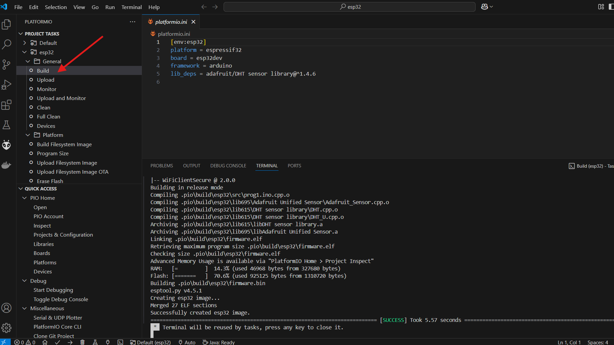
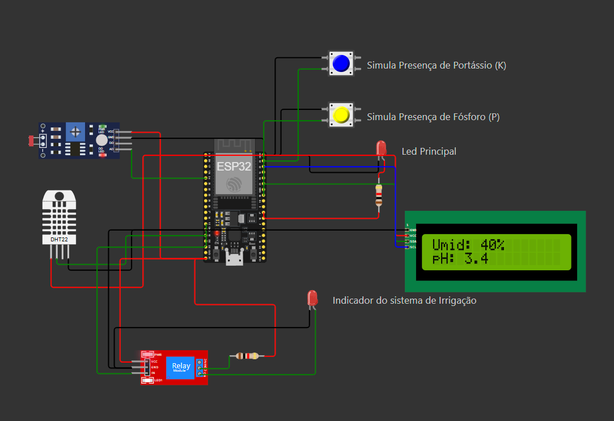

# Projeto de Sensores de Coleta de dados no campo

## 1 - Introdução

Este módulo contem os dados do projeto que simula usando Wokwi um microprocessador ESP32 conecdtado a internet com wi-fi plugado a diversos sensores coletando dados a cada 15 segundos e enviando para uma API armazenar esta informação para posterior analise.

Quando a umidade do solo é avalida pelo senor menor do que 30% ele ativa um Rele que simula uma irrigação, tão logo uma próxima coleta identifique que a umidade esta superior ou igual a 30% este relé é desativado.

## 2 - Setup do ambiente

Antes de poder usar, certifique-se de que você subiu a API de Coleta e expos ela conforme as instruçòes contidas nesta documentação [Documento da API Python de Coleta](../api-python/README.MD)

### 2.1 - Instale os plugins para suporte a emulação do ESP32

Conforme explicado em aula, instale os seguintes plugins para que este projeto funcione no seu computador:
* Wokwi Simulator
* PlatformIO IDE

### 2.2 - Reconfigurando a URL da API

Uma ves que você tem sua API rodando e exposta na internet, conforme item 3.3 da documentação da API, precisamos informar esta URL no código.
Edite o arquivo [Programa ESP32](./src/prog1.ino) e na linha 17 substitua o valor https://<minha-url-cloudfare>/ pela sua URL gerada na cloudflare. Não esqueça de finalizar a url com "/" como no exemplo que lá está. 

### 2.3 - Compile o programa

Uma vez o programa tendo ajustado, vamos compilar ele. Na lateral esquerda do Visual Studio Code, procre pelo ícone do PlatformIO, clique nele, e escolha a opção "build" e aguarde seu código ser compilado

## 3 - Executando o projeto

### 3.1 - Iniciando a simulação

Clique no Visual Studio no menu esquerdo no ícone que representa a palheta de arquivos e selecione o arquivo diagram.json.
Ele deve abrir como a imagem a seguir. Para executá-lo clique no sinal de Play.

### 3.2 - Sinais no Led Principal

O Led principal é usado para enviar sinais ao usuário, são eles:
* pisca 3 vezes para indicar que terminou o start e se conectou a rede wi-fi
* pisca 2 vezes sempre que for iniciar a coleta (agendada para cada 15 segundos)
* pisca 4 vezes rápidas para indicar que umidade esta baixa e ativa a irrigação (acendendo o Led que indica o funcionamento da mesma)

### 3.3 - Simulando situações

Durante a execução do simulador, você interagir com os 4 sensores:
* DHT22 -> sensor de umidade que quando configurado abaixo de 30% ativa a irrigação
* Botão Azul -> Se estiver pressionado durante a coleta simula a presença de Potássio no solo
* Botão Amarelo -> Se estiver pressionado durante a coleta simula a presença de Fósforo no solo
* LDR -> É um sensor de luminosidade que aqui simula valores para pH

### 3.4 - Monitoramento via SerialPlotter
Foi utilizado SerialPlotter para fazer o monitoramento em tempo real da umidade e do PH

Também foi adicionado um display LCD para verificar essas variaveis no proprio ESP32

## 4 - Mudanças feitas:
- Adicionado novo componente no ESP32 sendo ele o displayLCD
- Feita lógica para implementar e Exibir os dados das variaveis no LCD através do código c/c++
- Otimização da forma como o PH era coletado
  - Convertendo o valor para um numéro entre 0 e 14 para melhor representar a simulação do PH vindo do sensor de luminosidade

## 5 - Grupo de Trabalho

Este trabalho foi realizado em grupo pelos seguintes alunos:

* Richard - rm563313
* Douglas - rm561335
* Evelyn - rm562451
* Lucas - rm564892
* Luis - rm565285
