# FIAP - Faculdade de Informática e Administração Paulista 


# Fase 05 Cap 1

## FarmTech na era da cloud computing

## Grupo DRELL

## 👨‍🎓 Integrantes: 
- <a href="https://www.linkedin.com/in/douglas-souza-felipe-b815281a2/">Douglas</a>
- <a href="https://www.linkedin.com/in/richard-marques-26b3a14/">Richard</a>
- <a href="https://www.linkedin.com/in/lucasmedeirosleite">Lucas Medeiros</a> 
- <a href="https://www.linkedin.com/in/evelyn-z-342a07365/">Evelyn Z</a> 
- <a href="https://www.linkedin.com/in/luis-fernando-dos-santos-costa-b69894365/">Luis</a>

## 👩‍🏫 Professores:
### Tutor(a) 
- <a href="https://github.com/leoruiz197">Leo Ruiz</a>
### Coordenador(a)
- <a href="https://www.linkedin.com/in/andregodoichiovato/">Andre Godoi</a>


## 📜 Descrição

Este repositório contém os assets usados para explorar a base de dados de cultivo fornecida pelo professor para poder treinar modelos de IA supervisionado e não supervisionado para identificar os itens a seguir:
- Encontrar tendencias para os rendimentos das plantações usando modelos não supervisionados para agrupar (clusterização) os dados da base permitindo inclusive identificar os "pontos fora da curva" chamados outliers.
- Prever o rendimento da safra usando modelos supervisionados de predição (testar 5 algoritmos diferentes comprando sua performance com indicadores com acurácia, precisão e F1-Score)

Todo o projeto explicado neste tutorial esta detalhado (usando a mesma estrutura de capíulos no Jupyter Notebook na pasta assets deste repositório: [Codigo](assets/RichardMarques_rm563313_pbl_fase5.ipynb)

O projeto foi também explicado no video postado no youtube. <a href="https://youtu.be/4RHRzyVQJVc">Video Youtube - Modelos de Machine Learning</a>

### Pre-requisitos

Para executar os códigos deste repostório você vai precisar atender os seguintes requisitos técnicos:
- Python 3.9 ou superior
- ter instalado as bibliotecas contidas no arquivo requirements.txt instaladas no seu ambiente

```
python3 -m pip install -r requirements.txt
```

Para cupriir estes objetivos o trabalho foi realizado usando a seguinte metodologia:

### 1 - Exploração, entendimento e preparação dos dados
- Verificar a qualidade dos dados (se o modelo é bem comportado ou não virificando duplicadade, valores nulos e distribuição dos dados)
- Preparar os dados (usando PCA para reduzir a quantidade de dimensões se necessário, remoção de valores nulos e/ou outliers, e removendo registros duplicados)

#### 1.1 - Conhecendo os dados
Primeira etapa foi carregar o modelo e tentar entender suas características, distribuição e features. Para isso usamos a biblioteca "Pandas" para carregar os dados e usar o método "info()" para conseguir mais informações sobre ele.

O resultado foi a lista das features como no exmeplo a seguir:
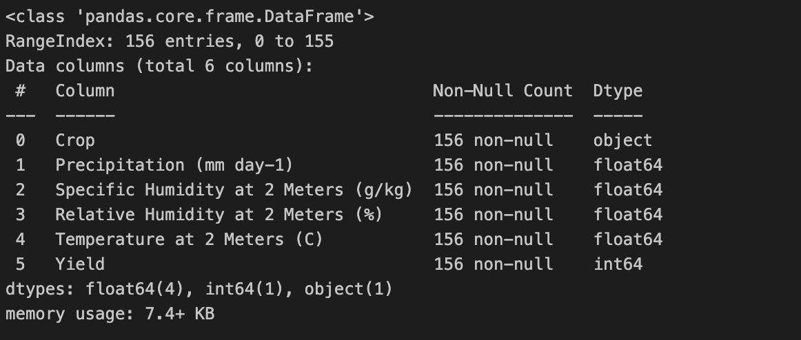

E também ainda usando o pandas, como método "head()" listamos os primeiros registros desta base. 
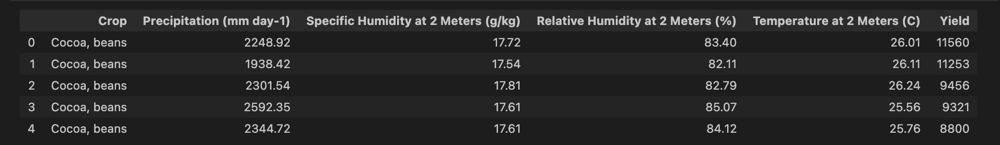

Chegamos a conclusão que esta é uma base bem comportada, não possui campos nulos. 


#### 1.2 - Nornaliznado os dados
Próximo passo, como descobrimos na etapa anterior, temos um campo texto, chamado "Crop" que representa o tipo de cultivo. Como aprendemos os modelos supervisionados e não supervisionados não lidam bem com dados que não são numéricos. Por isso, vamos converter esses texto para um valor numérico.

Aqui vamos inserir no nosso projeto uma nova biblioteca, chamada "sklearn" que possuem várias funções para trabalhar e manipular dados. Neste caso vamos usar o "LabelEncoder()" que faz justamente a conversão de valores texto para alguma representação numérica usando o método "fit_transformer" passando a coluna que queremos transformar como parâmetro, no caso a "Crop".

Desta forma o campo Crop foi convertido para um sequencial onde:
- 0 = Cocoa, beans
- 1 = Oil palm fruit
- 2 = Rice, paddy
- 3 = Rubber, natural

#### 1.3 - Duplicados
Próximo passo é verificar se existem dados duplicados na nossa base e remove-los. Para isso o próprio objeto DataSet que presenta a nossa base, gerado a partir do carregamento da base com o Pandas, possui um método para fazer esta validação. Usando o código a seguir conseguimos verificar se existem itens duplicados e remove-los se for verdade. 

```
# Verificar duplicados
duplicados = df[df.duplicated()]

# Resultado
if duplicados.empty:
    print("✅ Não existem registros duplicados na base.")
else:
    print("⚠️ Existem registros duplicados. Removendo dados!")
    df.drop_duplicates(inplace=True)
```

#### 1.4 - Avaliando a importância de cada feature 
Próxima etapa é avaliar o peso que cada feature no resultado final da produção. Para isso escolhi o algoritmo "RandomForestClassifier" para treinar e testar um modelo de classificação. Esse algoritmo esta disponível também na biblioteca "sklearn". Uma vez treinado o modelo, ele possui um método que nos traz esta informação, o método chamado "feature_importances_". Segue abaixo o resultado conseguido com a nossa base depois das etapas de removação de duplicação e encode. 

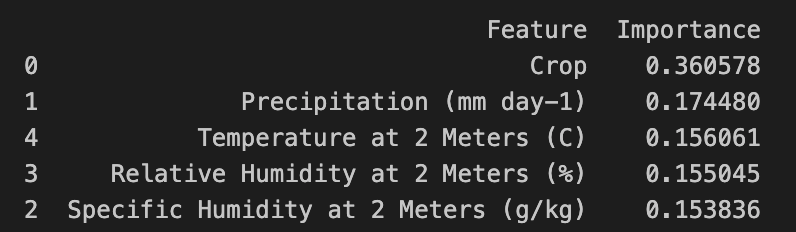

Agora usamos a biblioteca "matplotlib" junto com a "seaborn" para exibir um gráfico mostrando esses dados. 

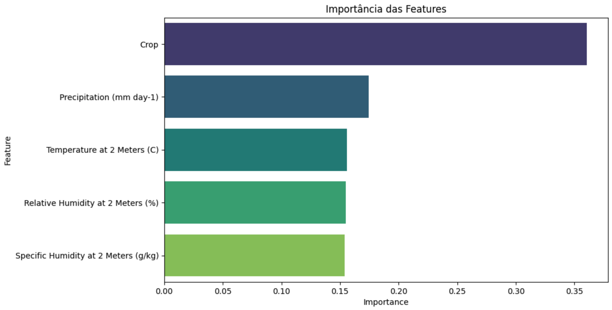

#### 1.5 - Cmoparando a relação entre as features
Agora vamos entender a influência e relação de cada feature comparada com as demais. Novamente vamos usar a combinação das bibliotecas "matplotlib" e "seaborn" para fazer a exibição dessa informmação entre a relação e a distribuição dos dados quando comparada as suas features. 

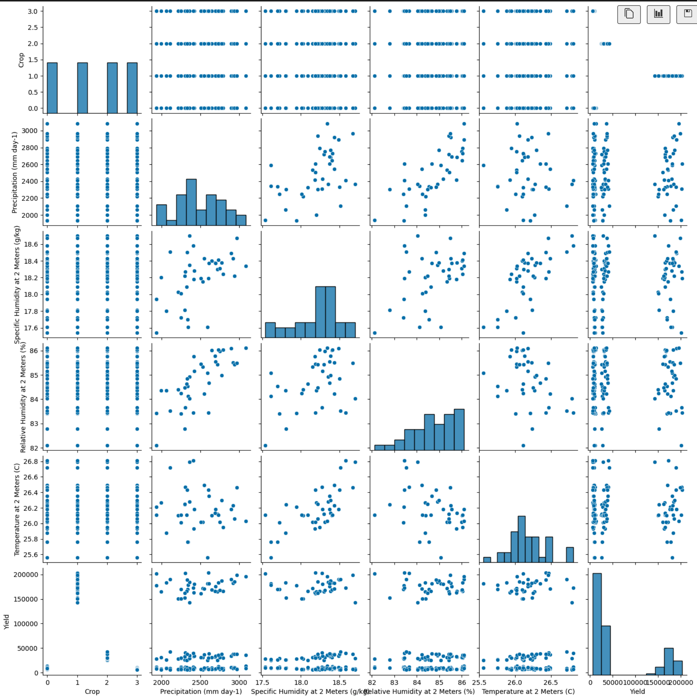

Vamos ver essa relação por outra perspectiva, com uma nota de influência, quanto mais próximo de 1 mais as variáveis estão relacionadas. 

,Specific Humidity at 2 Meters (g/kg),Relative Humidity at 2 Meters (%),Temperature at 2 Meters (C) representam as condições climáticas
- o campo "Yield" representa a produção daquela safra dadas o tipo de cultivo e condições climáticas


### 2 - Classificar os dados com modelo não supervisionado
- identificar qual o melhor algoritimo para esta tarefa dado a missão e característica dos dados (removação de bias, variedade dos dados, etc)
- Definir a melhor parametrixação do modelo dado o objetivo (quantidade de clusters)
- separar dados para testes e treinamento
- treinar o modelo
- validar seu resultado

#### 2.1 - Avaliar o melhor modelo para esta tarefa
Dado a explocação que fizemos nos dados e as conclusões que chegamos no item 1.7 e que nossa missão é encontrar grupos claros e compactos de culturas com base nas condições climáticas entendo que o KMeans é a melhor opção por funcionar bem com datasets menores. O DBScan por exemplo tem melhores resultados com mais exemplos (base de dados maior).

#### 2.2 - Normalizar os dados originalmente em escalas diferentes
Para facilitar o estudo precisamos colocar os diferentes campos em uma mesma escala para entender melhor a distribuição dos dados. Para esta tarefa vamos usar o "StandardScaler" que também pertence ao "sklearn". 

#### 2.3 - Gerando um gráfico Dendrograma (Hierárquico) para exploração da distribuição
Aqui vamos usar a biblioteca "scipy" para gerar um mapa hierarquico da distribuição dos valores das features. 

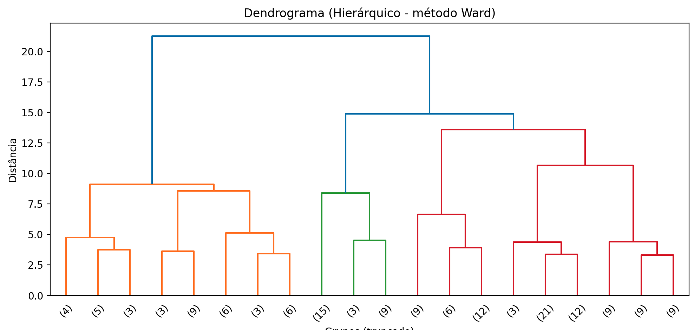

Já nesta análise conseguimos ver claramente ao menos 3 grandes grupos. 

#### 2.4 - Aplicar método cotovelo para identificar o número de Clusters
A ideia desta etapa é gerar o gráfico de cotovelo para poder identificar o número ideal de clusters. 

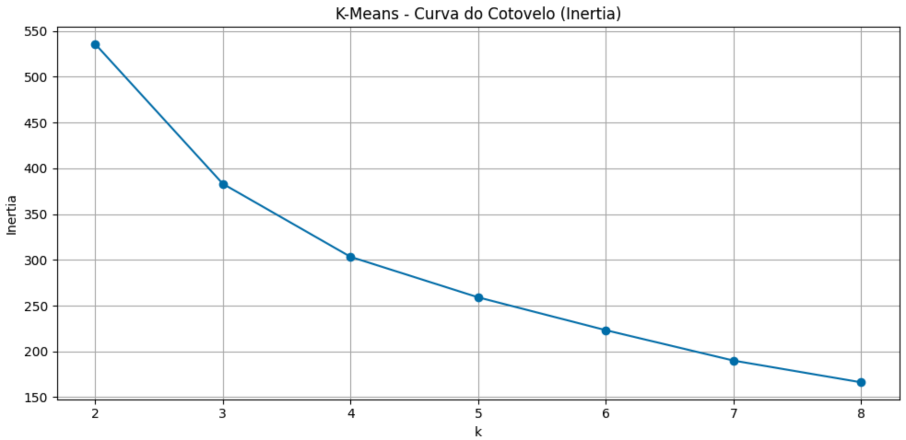

Como podemos ver, a curva se mantem firme até o final porém tem uma queda significativa na descida entre o 3 e 4, ou seja, recomenda o uso de 8 clusters porém também corrobora o uso de 3 cluster como apontado pelo Demoráfico.

#### 2.5 - Treinando o modelo e executando ele
Vamos usar o valor 3 identificado pelo demografico, também corroborado pelo método de cotovelo que mostra uma queda na intensidade de descida a partir do mesmo número. O valor 3 será usado como o número ideal para o número de clusters e medir o resultado com o silhoutte score da uma nota ao processo de clusterização pela coesão e separação. 
Nesta medição quanto menor a distancia média entre os pontos maior é a coesão (e melhor é este cluster)
Quanto maior a distância entre os clusters diferentes, melhor terá sido a separação entre eles. 

Vamos exibir esta distribuição em 2D, para isso vamos usar a tecnica de PCA para reduzir a dimensionalidade. 

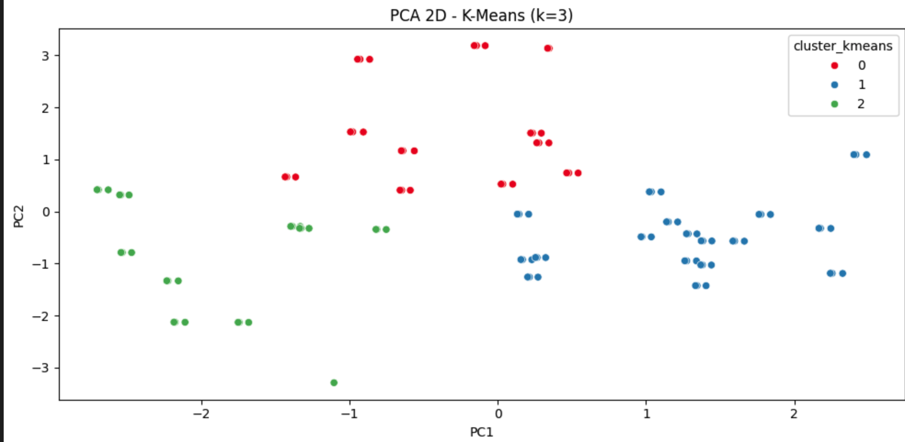

#### 2.6 - Conclusão
Pela distribuição dos dados percebemos 3 grandes grupos bem distribuidos onde:
- Grupo mais a esquerda mostra baixa produtividade em condições climáticas baixas (no máximo mediana)
- Grupo mais ao centro e mais alto, onde mostra que o equilibrio das condições climáticas gera uma maior produtividade
- Grupo mais a direita onde condições mais extremas do clima compromete novamente a produtividade.

Em resdumo Muita água, humidade e temperatura compromente a produtividade da safra da mesma forma que pouca água, humidade e temperatura também. 

### 3 - Treinar 5 modelos (usando algoritmos diferentes) para predizer o rendimento da safra
- Escolher 5 modelos diferentes
- treinar os modelos
- comparar os resultados de cada modelo 
- testar com pelo menos um modelo a explicabilidade usando LIME e SHAP

#### 3.1 - Escolher os modelos
Escolhemos os 5 modelos abaixo para este experimento:
- LinearRegression
- RidgeCV
- SVR_RBF
- RandomForest
- GradientBoosting

#### 3.2 - Separar os dados de teste e treinamento, e treinar o modelo
Nesta etapa vamos sepaarar parte dos dados para treino e parte para testar o modelo depois. Vamos usar o método de K-Fold que separar os dados em vários pedaços e treina e valida o resultado do modelo, depois re-treina com uma nova porção dos dados e valida com outra, assim por diante até ter usado dos os dados como teste e como massa para treino. Feito é cálculado a média do resultado aferido em cada um destes cenários. 

#### 3.3 - Avaliar o resultado obitdo com cada modelo
Os modelos foram avaliados usando as métricas: 
- R2 (Coeficiencia de Determinacao) -> esta métrica quanto mais perto de 1 indica que o mdelos é mais preciso, quanto mais longe, menos preciso
- MAE (Mean Absolute Error / Erro Absoluto Médio) -> Média das diferenças em valor absoluto entre o real e o previsto
- RMSE (Root Mean Squared Error / Raiz do Erro Quadrático Médio) -> É a raiz quadrada da média dos erros ao quadrado:

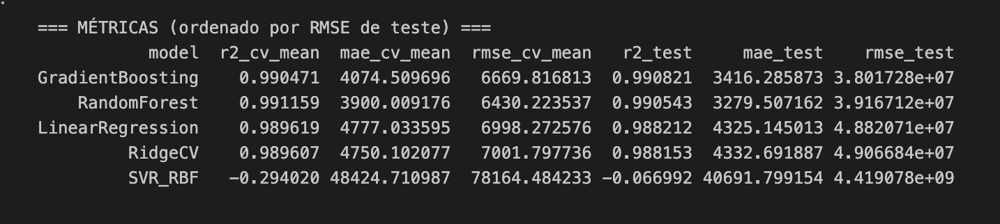

Em resumo o modelo baseado em GradientBoosting teve a melhor performance entre os 5 testados. 

### 4 - Estimativa de custos para executar estes modelos
Nesta estapa vamos usar a calculadora da AWS para estimar os custos mensal da infraestrutura para executar estes modelos

#### 4.1 - Requisitos
A infraestrutura necessária para executar estes códigos em Python é:
1 Servidor Linux com as seguintes características:
- 2 CPUs.
- 1 GIB de memória.
- Até 5 Gigabit de rede.
- 50 GB de armazenamento (HD).

#### 4.2 - Usando a calculadora AWS
Acessa a URL a seguite para abrir a calculadora AWS, chmada de "AWS Pricing calculator".
<a href="https://calculator.aws/#/">Calculadora AWS</a>

Siga os passos abaixo:
a) Clique no botão "Criar uma estimativa"
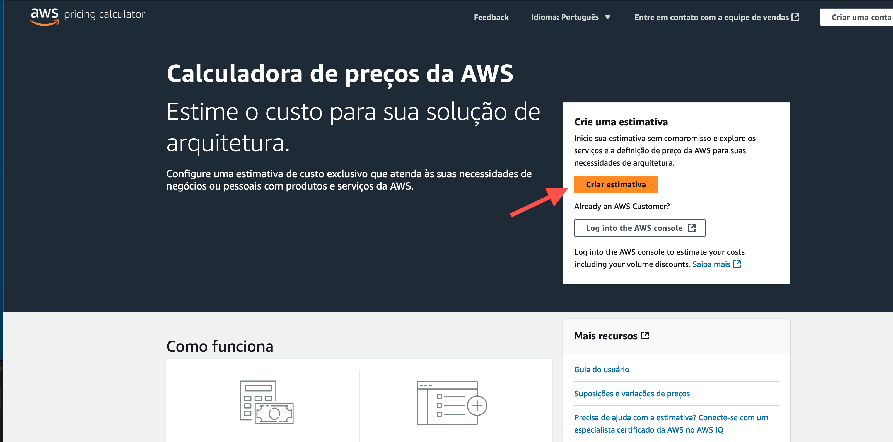

b) Escolha "Pesquisa por tipo de Local", mantenha a opção "Estolher um tipo de local" como "Região", e no campo "Escolher Região" escolha a opção: "sa-east-1".

Esta região é a única da AWS disponível no Brasil, vamos seguir com ela por hora. 


c) Preencha "ec2" no campo de busca "Localizar serviço", até que apareça na lista abaixo o serviço "Amazon EC2" que é o serviço de servidores virtuais da Amazon, e clique em "Configurar".

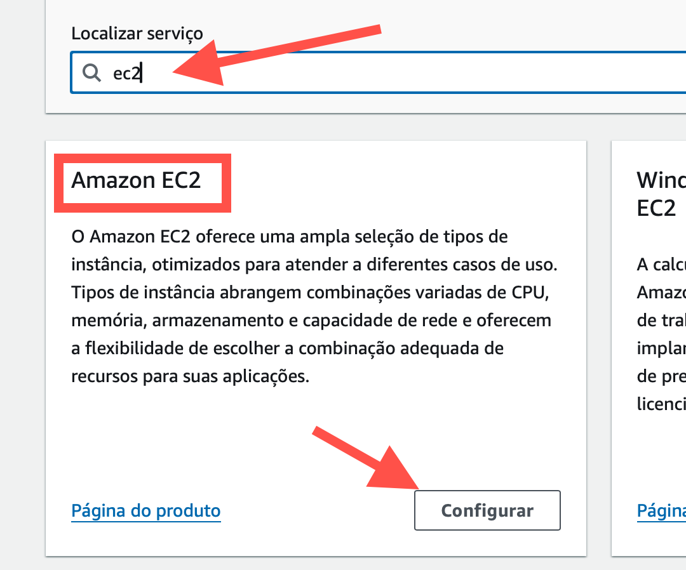

d) Preencha os campos abaixo:
- Locação: "instancias compartilhadas"
- Sistema operacional: "Linux"
- Cargas de trabalho: "Uso constante"
- Número de Instâncias: "1"
- Pesquisa tipo de Instancia: "t4g.micro"

Feito isso você verá que na lista de instancias aparecerá somente uma instância e ela tem os requisitos que precisamos, selecinoe ela na lista e confirme no botão "Salvar e adicionar serviço"

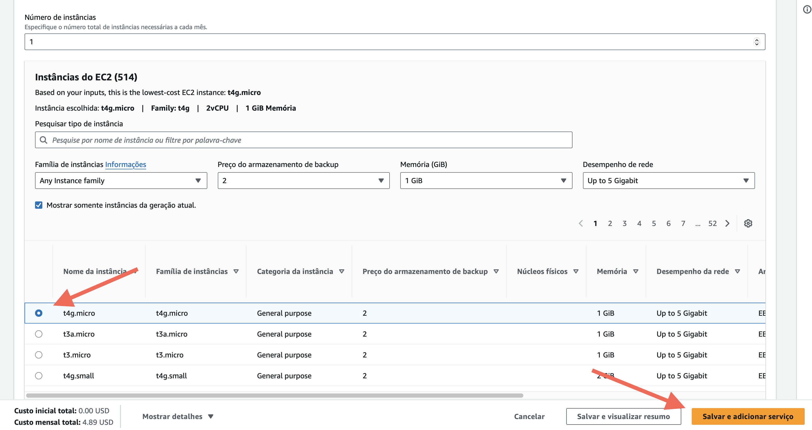

e) Confirme o valor do orçamento clicando no botão "Visualizar Resumo"

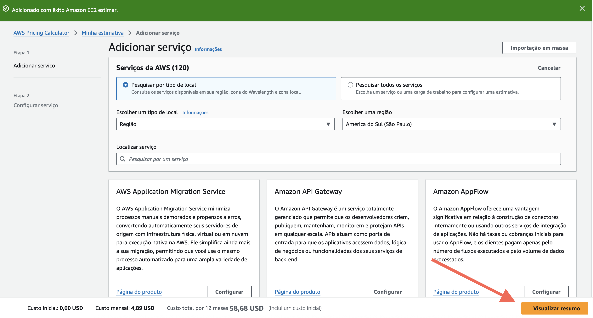

Com isso a calculadora vai mostrar um resumo dos seus custos, que para o meu usuário, no momento da realização desta cotação, ficou em US$ 58,68 por ano já incluindo um custo inicial. 

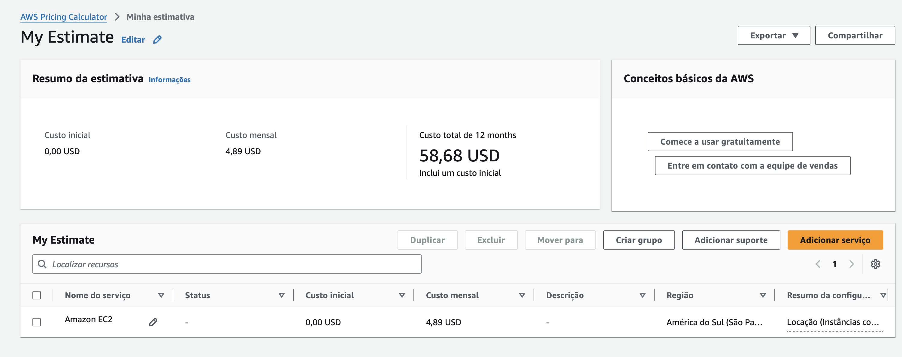

f) Repita os passos, com exceção do item b você vai escolher outra região, a de N. Virginia

Ao final do processo você vai ver que o custo do mesmo servidor nesta região é quase metade do preço. A cotação final para o mesmo serviço é de US$ 36,84.


g) Caso você tenha uma restrição por questão de legislação por exemplo de que os dados precisam ficar no pais, no caso o Brasil, mesmo sendo mais caro a opção seria provisionar os serviços na Região sa-east-1.

Segue o link para o video da explicação do uso da calculadora AWS: 
<a href="https://youtu.be/zrM5vME0alo">Video no Youtube</a>

## 📁 Estrutura de pastas

Dentre os arquivos e pastas presentes na raiz do projeto, definem-se:

- <b>assets</b>: aqui estão os arquivos relacionados a elementos não-estruturados deste repositório, como imagens.

- <b>jupyter</b>: aqui foi armazendo o Jupyter Notebook usado para explorar os dados, treinar os modelos e fazer os experimentos

- <b>README.md</b>: arquivo que serve como guia e explicação geral sobre o projeto (o mesmo que você está lendo agora).


## 📋 Licença

<p xmlns:cc="http://creativecommons.org/ns#" xmlns:dct="http://purl.org/dc/terms/"><a property="dct:title" rel="cc:attributionURL" href="https://github.com/agodoi/template">MODELO GIT FIAP</a> por <a rel="cc:attributionURL dct:creator" property="cc:attributionName" href="https://fiap.com.br">Fiap</a> está licenciado sobre <a href="http://creativecommons.org/licenses/by/4.0/?ref=chooser-v1" target="_blank" rel="license noopener noreferrer" style="display:inline-block;">Attribution 4.0 International</a>.</p>
